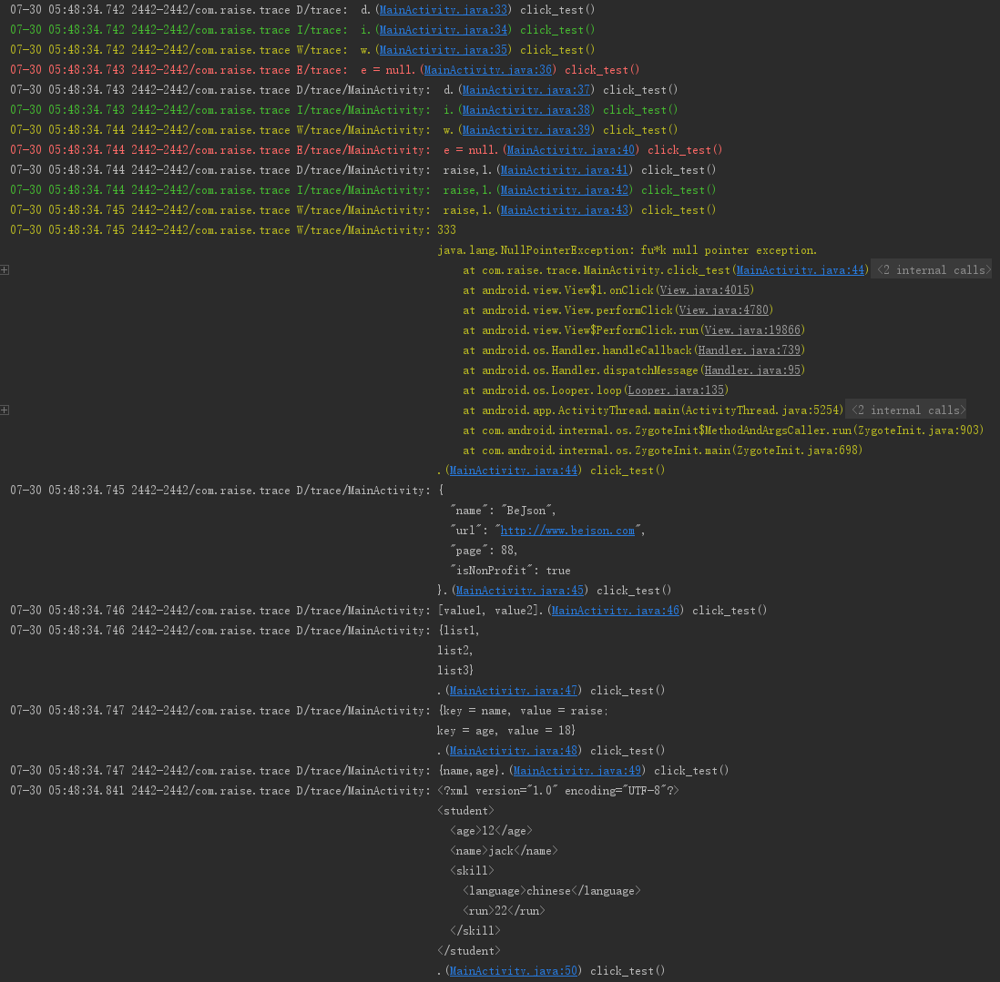

# [TRACE](https://github.com/raiseyang/Trace)

一个简单的日志封装类，支持打印日志时的常用功能，代码简单就一个类，源码清晰；

使用方法
- gradle添加依赖
  `compile 'cn.raiseyang:lib_trace:1.0.1'`

## 功能
1. 方便调用：Trace.d();
2. 无需初始化，直接使用
3. 支持保存文件
4. 支持logcat跟踪源码
5. 支持自定义配置
6. 支持格式化打印array,list,map,set,json,xml
7. 支持打印线程信息
8. 支持格式化字符串
9. 支持打印异常调用栈

## 不足
1. 控制台输出4K的限制，日志文件无限制

## 使用示例
```
Trace.d(TAG, " d");
Trace.i(TAG, " i");
Trace.w(TAG, " w");
Trace.e(TAG, " e = " + null);
Trace.d(TAG, " %s,%d", "raise", 1);
Trace.i(TAG, " %s,%d", "raise", 1);
Trace.w(TAG, " %s,%d", "raise", 1);
Trace.e(TAG, new NullPointerException("fu*k null pointer exception."));
Trace.json(TAG, "{\"name\":\"BeJson\",\"url\":\"http://www.bejson.com\",\"page\":88,\"isNonProfit\":true}");
Trace.array(TAG, new String[]{"value1", "value2"});
Trace.list(TAG, Arrays.asList("list1", "list2", "list3"));
Trace.xml(TAG,"<student><age>12</age><name>jack</name><skill><language>chinese</language><run>22</run></skill></student>");
Trace.file(TAG, new File(Environment.getExternalStorageDirectory().getAbsolutePath()+"/test.log"));
```

## 效果
